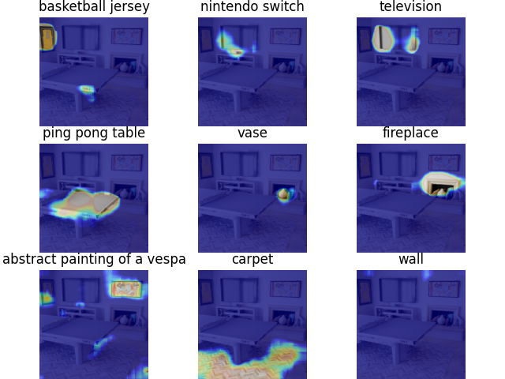
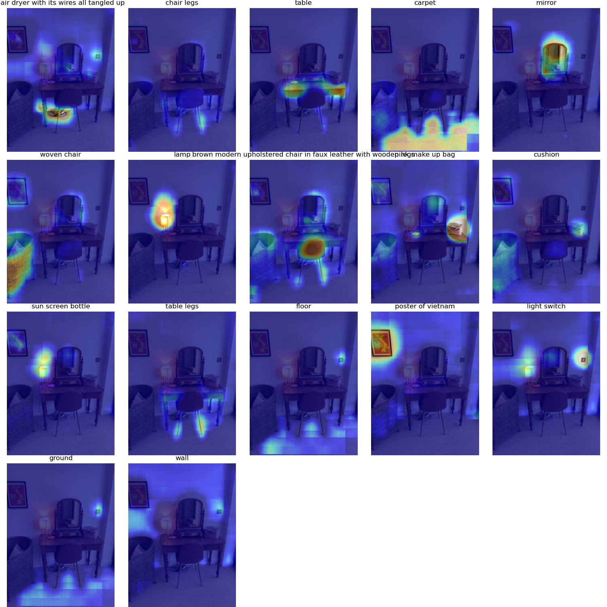
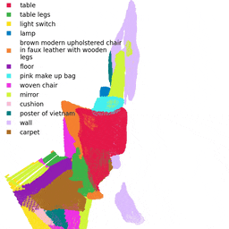
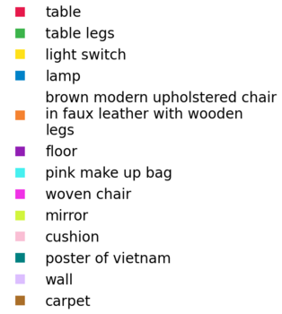

<h1> Semantic Abstraction: Open-World 3D Scene Understanding from 2D Vision-Language Models</h1>
<div style="text-align: center;">

[Huy Ha](https://www.cs.columbia.edu/~huy/),  [Shuran Song](https://www.cs.columbia.edu/~shurans/)

Columbia University, New York, NY, United States

[Conference on Robot Learning 2022](https://corl2022.org/)

[Project Page](https://semantic-abstraction.cs.columbia.edu/) | [Arxiv](https://arxiv.org/abs/2207.11514)

[](https://huggingface.co/spaces/huy-ha/semabs-relevancy)

<div style="margin:50px; text-align: justify;">


Our approach, Semantic Abstraction, unlocks 2D VLM's capabilities to 3D scene understanding. Trained with a limited synthetic dataset, our model generalizes to unseen classes in a novel domain (i.e., real world), even for small objects like “rubiks cube”, long-tail concepts like “harry potter”, and hidden objects like the “used N95s in the garbage bin”. Unseen classes are bolded.

</div>
</div>

<br>

This repository contains code for generating relevancies, training, and evaluating [Semantic Abstraction](https://semantic-abstraction.cs.columbia.edu/).
It has been tested on Ubuntu 18.04 and 20.04, NVIDIA GTX 1080, NVIDIA RTX A6000, NVIDIA GeForce RTX 3080, and NVIDIA GeForce RTX 3090.

If you find this codebase useful, consider citing:

```bibtex
@inproceedings{ha2022semabs,
    title={Semantic Abstraction: Open-World 3{D} Scene Understanding from 2{D} Vision-Language Models},
    author = {Ha, Huy and Song, Shuran},
    booktitle={Proceedings of the 2022 Conference on Robot Learning},
    year={2022}
}
```

If you have any questions, please contact [me](https://www.cs.columbia.edu/~huy/) at `huy [at] cs [dot] columbia [dot] edu`.

**Table of Contents**

- [Setup](#setup)
  - [Environment](#environment)
  - [Models](#models)
  - [Dataset (Optional)](#dataset-optional)
- [Multi-scale Relevancy Extractor](#multi-scale-relevancy-extractor)
- [Evaluation](#evaluation)
  - [Summarize](#summarize)
  - [Run inference](#run-inference)
  - [Visualization](#visualization)
- [Training](#training)
  - [OVSSC](#ovssc)
  - [VOOL](#vool)
- [Codebase Walkthrough](#codebase-walkthrough)
- [Acknowledgements](#acknowledgements)

# Setup

## Environment

Create the conda environment

```sh
conda env create -f semabs.yml
```

## Models

Download the model checkpoints (~3.5GB) by running this command at the root of the repo
```sh
wget https://semantic-abstraction.cs.columbia.edu/downloads/models.tar.lz4  -O - | tar --use-compress-program=lz4 -xf -  -C ./ 
```

You should have the following directory structure

```console
❯ tree /path/to/semantic-abstraction/models
/path/to/semantic-abstraction/models
├── chefer_et_al
│   ├── ovssc
│   │   ├── args.pkl
│   │   ├── ovssc.pth
│   │   └── ovssc_eval_stats.pkl
│   └── vool
│       ├── args.pkl
│       ├── vool.pth
│       └── vool_eval_stats.pkl
├── clipspatial
│   └── vool
│       ├── args.pkl
│       ├── vool.pth
│       └── vool_eval_stats.pkl
├── ours
│   ├── ovssc
│   │   ├── args.pkl
│   │   ├── ovssc.pth
│   │   └── ovssc_eval_stats.pkl
│   └── vool
│       ├── args.pkl
│       ├── vool.pth
│       └── vool_eval_stats.pkl
└── semaware
    ├── ovssc
    │   ├── args.pkl
    │   ├── ovssc.pth
    │   └── ovssc_eval_stats.pkl
    └── vool
        ├── args.pkl
        ├── vool.pth
        └── vool_eval_stats.pkl

11 directories, 21 files
```


## Dataset (Optional)

To run the evaluation inference or training, you will need the dataset.

Download the dataset (~269GB) by running the following at the root of the repo
```sh 
wget https://semantic-abstraction.cs.columbia.edu/downloads/dataset.tar.lz4  -O - | tar --use-compress-program=lz4 -xf -  -C ./
```


We also preprocessed the (~53GB) NYU dataset for training and evaluation
```sh 
wget https://semantic-abstraction.cs.columbia.edu/downloads/nyu_ovssc.tar.lz4  -O - | tar --use-compress-program=lz4 -xf -  -C ./
```


# Multi-scale Relevancy Extractor

Play around with the multi-scale relevancy extractor on [](https://huggingface.co/spaces/huy-ha/semabs-relevancy).

To run the multi-scale relevancy on GPU locally with the provided image from matterport

```sh
python generate_relevancy.py image
```

which will output



Try passing in your own image!

```console
❯ python generate_relevancy.py image --help

 Usage: generate_relevancy.py image [OPTIONS] [FILE_PATH]                                        
                                                                                                 
 Generates a multi-scale relevancy for image at `file_path`.                                     
                                                                                                 
╭─ Arguments ───────────────────────────────────────────────────────────────────────────────────╮
│   file_path      [FILE_PATH]  path of image file [default: matterport.png]                    │
╰───────────────────────────────────────────────────────────────────────────────────────────────╯
╭─ Options ─────────────────────────────────────────────────────────────────────────────────────╮
│ --labels         TEXT  list of object categories (e.g.: "nintendo switch")                    │
│                        [default: basketball jersey, nintendo switch, television, ping pong    │
│                        table, vase, fireplace, abstract painting of a vespa, carpet, wall]    │
│ --prompts        TEXT  prompt template to use with CLIP.                                      │
│                        [default: a photograph of a {} in a home.]                             │
│ --help                 Show this message and exit.                                            │
╰───────────────────────────────────────────────────────────────────────────────────────────────╯
```

# Evaluation

## Summarize

The evaluation result dataframes (`*_eval_stats*.pkl`) are provided along with the model checkpoints.
To summarize them in a table

```console
❯ python summarize.py
                                    OVSSC THOR
                          ╷            ╷              ╷             ╷
  Approach                │ Novel Room │ Novel Visual │ Novel Vocab │ Novel Class
 ═════════════════════════╪════════════╪══════════════╪═════════════╪═════════════
  Semantic Aware          │       32.2 │         31.9 │        20.2 │         0.0
  SemAbs + [Chefer et al] │       26.6 │         24.3 │        17.8 │        12.2
 ─────────────────────────┼────────────┼──────────────┼─────────────┼─────────────
  Ours                    │       40.1 │         36.4 │        33.4 │        37.9
                          ╵            ╵              ╵             ╵
                                            FULL VOOL THOR
                          ╷                  ╷            ╷              ╷             ╷
  Approach                │ Spatial Relation │ Novel Room │ Novel Visual │ Novel Vocab │ Novel Class
 ═════════════════════════╪══════════════════╪════════════╪══════════════╪═════════════╪═════════════
  Semantic Aware          │ in               │       15.0 │         14.7 │         7.6 │         1.8
                          │ on               │        9.0 │          8.9 │        11.4 │         4.5
                          │ on the left of   │       11.2 │         11.1 │        14.4 │         4.0
                          │ behind           │       12.8 │         12.6 │        14.1 │         2.2
                          │ on the right of  │       13.1 │         13.0 │        11.5 │         3.4
                          │ in front of      │       11.2 │         11.1 │         9.3 │         2.2
                          │ mean             │       12.1 │         11.9 │        11.4 │         3.0
 ─────────────────────────┼──────────────────┼────────────┼──────────────┼─────────────┼─────────────
  ClipSpatial             │ in               │        9.6 │          8.6 │         7.1 │         3.3
                          │ on               │       14.1 │         12.1 │        18.5 │        20.0
                          │ on the left of   │       11.0 │          9.4 │        14.2 │        13.2
                          │ behind           │       11.3 │          9.9 │        14.1 │         8.9
                          │ on the right of  │       12.1 │         10.6 │        16.2 │        11.5
                          │ in front of      │       12.3 │         10.3 │        15.7 │         9.9
                          │ mean             │       11.7 │         10.1 │        14.3 │        11.2
 ─────────────────────────┼──────────────────┼────────────┼──────────────┼─────────────┼─────────────
  SemAbs + [Chefer et al] │ in               │       11.8 │         11.1 │         5.7 │         2.1
                          │ on               │        7.0 │          6.7 │        11.3 │         7.1
                          │ on the left of   │        9.5 │          9.3 │        13.7 │         4.9
                          │ behind           │        7.6 │          7.6 │        10.6 │         2.5
                          │ on the right of  │        9.2 │          9.2 │        11.0 │         3.9
                          │ in front of      │        9.4 │          9.0 │        12.0 │         3.3
                          │ mean             │        9.1 │          8.8 │        10.7 │         4.0
 ─────────────────────────┼──────────────────┼────────────┼──────────────┼─────────────┼─────────────
  Ours                    │ in               │       17.8 │         17.5 │         8.5 │         7.3
                          │ on               │       21.0 │         18.0 │        27.2 │        28.1
                          │ on the left of   │       22.0 │         20.3 │        27.7 │        25.1
                          │ behind           │       19.9 │         18.0 │        22.8 │        16.7
                          │ on the right of  │       23.2 │         21.7 │        28.1 │        22.1
                          │ in front of      │       21.5 │         19.4 │        25.8 │        19.1
                          │ mean             │       20.9 │         19.2 │        23.4 │        19.7

                                                    OVSSC NYU                                                    
                    ╷         ╷       ╷      ╷        ╷       ╷      ╷      ╷       ╷      ╷      ╷      ╷       
  Approach          │ Ceiling │ Floor │ Wall │ Window │ Chair │  Bed │ Sofa │ Table │  Tvs │ Furn │ Objs │ Mean  
 ═══════════════════╪═════════╪═══════╪══════╪════════╪═══════╪══════╪══════╪═══════╪══════╪══════╪══════╪══════ 
  Ours (Supervised) │    22.6 │  46.1 │ 33.9 │   35.9 │  23.9 │ 55.9 │ 37.9 │  19.7 │ 30.8 │ 39.8 │ 27.7 │ 34.0  
 ───────────────────┼─────────┼───────┼──────┼────────┼───────┼──────┼──────┼───────┼──────┼──────┼──────┼────── 
  Ours (Zeroshot)   │    13.7 │  17.3 │ 13.5 │   25.2 │  15.2 │ 33.3 │ 31.5 │  12.0 │ 23.7 │ 25.6 │ 19.9 │ 21.0  
                    ╵         ╵       ╵      ╵        ╵       ╵      ╵      ╵       ╵      ╵      ╵      ╵      
```

## Run inference

To run inference, make sure the dataset is [downloaded](#dataset-optional).

Then, regenerate the evaluation result dataframes by running the evaluation script.

For OVSSC

```sh
python -m torch.distributed.run --nnodes=1 --nproc_per_node=1 eval.py --task ovssc  --file_path dataset/  --gpus 0 --load models/ours/ovssc/ovssc.pth
```

Inference can be sped up by using more than one GPU.
For instance, to use GPU 0, 1, 2, and 3, use `--nproc_per_node=4` and `--gpus 0 1 2 3`.

For OVSSC on NYU
```sh
python -m torch.distributed.run --nnodes=1 --nproc_per_node=1 eval.py --task ovssc  --file_path nyu_ovssc/ --gpus 0 --load models/ours/ovssc/ovssc.pth
```

Similarly, for VOOL

```sh
python -m torch.distributed.run --nnodes=1 --nproc_per_node=1 eval.py --task vool  --file_path dataset/  --gpus 0 --load models/ours/vool/vool.pth
```

## Visualization

The `visualize.py` script takes as input the scene pickle file and the network checkpoint.

The pickle file should be a dictionary with the following keys and types
```python
rgb: np.ndarray # shape h x w x 3
depth: np.ndarray # shape h x w
img_shape: Tuple[int, int]
cam_intr: np.ndarray # shape 4 x 4
cam_extr: np.ndarray # shape 4 x 4
ovssc_obj_classes: List[str]
descriptions: List[List[str]]
```
After being loaded, `rgb` and `depth` will be resized to `img_shape`, which matches the image dimensions in `cam_intr`.
Each element in descriptions is a list containing the target object name, spatial preposition and reference object name respectively.
We provide some example scene pickle files from [Habitat Matterport 3D](https://aihabitat.org/datasets/hm3d/) and [ARKitScenes](https://github.com/apple/ARKitScenes) in `scene_files/`.

Visualizing OVSSC generates a `.mp4` video of the completion, along with `.obj` meshes, while visualizing VOOL generates `.mp4` videos along with `.ply` pointclouds for each description.

For instance, running 
```sh
# OVSSC
python visualize.py ovssc-inference scene_files/arkit_vn_poster.pkl models/ours/ovssc/ovssc.pth
python visualize.py ovssc-visualize visualization/arkit_vn_poster
# VOOL
python visualize.py vool-inference scene_files/arkit_vn_poster.pkl models/ours/vool/vool.pth
python visualize.py vool-visualize visualization/arkit_vn_poster
```
Will output to `visualization/arkit_vn_poster`, including the following relevancies



and the following VOOL localization for `the hair dryer with its wires all tangled up behind the table legs` and OVSSC completion:

| RGB                              | Localization                            | Completion                            |
| -------------------------------- | --------------------------------------- | ------------------------------------- |
|  |  |  |


While these visualizations are sufficient for debugging, I recommend using the `ply` and `obj` files to render in Blender.


| Legend                                               | Localization                                  |
| ---------------------------------------------------- | --------------------------------------------- |
|  |  |


# Training

To train the models, make sure the dataset is [downloaded](#dataset-optional).

## OVSSC

To retrain our model

```sh
python -m torch.distributed.run --nnodes=1 --nproc_per_node=8 train_ovssc.py  --file_path dataset/ --log models/new-ours --gpus 0 1 2 3 4 5 6 7 --epochs 200 --saliency_config ours
```

To retrain the semantic aware model

```sh
python -m torch.distributed.run --nnodes=1 --nproc_per_node=8 train_ovssc.py  --file_path dataset/ --log models/new-ours --gpus 0 1 2 3 4 5 6 7 --epochs 200 --approach semantic_aware
```

To retrain the semantic abstraction + [Chefer et. al](https://github.com/hila-chefer/Transformer-MM-Explainability) model

```sh
python -m torch.distributed.run --nnodes=1 --nproc_per_node=8 train_ovssc.py  --file_path dataset/ --log models/new-ours --gpus 0 1 2 3 4 5 6 7 --epochs 200 --approach semantic_aware
```

## VOOL

To retrain our model

```sh
python -m torch.distributed.run --nnodes=1 --nproc_per_node=8 train_vool.py  --file_path dataset/ --log models/new-ours --gpus 0 1 2 3 4 5 6 7 --epochs 200 --saliency_config ours
```

To retrain the semantic aware model

```sh
python -m torch.distributed.run --nnodes=1 --nproc_per_node=8 train_vool.py  --file_path dataset/ --log models/new-ours --gpus 0 1 2 3 4 5 6 7 --epochs 200 --approach semantic_aware
```

To retrain the CLIP-Spatial model

```
python -m torch.distributed.run --nnodes=1 --nproc_per_node=8 train_vool.py  --file_path dataset/ --log models/new-ours --gpus 0 1 2 3 4 5 6 7 --epochs 200 --approach clip_spatial
```

To retrain the semantic abstraction + [Chefer et. al](https://github.com/hila-chefer/Transformer-MM-Explainability) model

```sh
python -m torch.distributed.run --nnodes=1 --nproc_per_node=8 train_vool.py  --file_path dataset/ --log models/new-ours --gpus 0 1 2 3 4 5 6 7 --epochs 200 --approach semantic_aware
```


# Codebase Walkthrough

Below, we've provided a summary of the networks provide, along with how and where our method as described in the paper is implemented. The links in the bullet points below links to specific lines in this codebase. We hope this code annotation helps clarify the network architecture and training procedures.

- [`SemAbs3D`](net.py#L319): This class implements the SemAbs module. It contains two networks, a [`ResidualUNet3D`](unet3d.py) (i.e, $f_\mathrm{encode}$) and an [`ImplicitVolumetricDecoder`](net.py#L204) (i.e, $f_\mathrm{decoder}$).
- [`SemanticAwareOVSSC`](net.py#L441): This class implements the SemAware baseline in the OVSSC task. It inherits directly from `SemAbs3D`, with two crucial differences: 1) it [takes RGB pointclouds as input](train_ovssc.py#L237) instead of [saliency pointclouds](utils.py#L94), and ) it uses its [sampled feature pointclouds to point](net.py#L455) to text features of semantic classes (i.e., encoded using CLIP's text encoder). These two differences together mean it has to learn to recognize semantic classes from RGB inputs by itself, which leads to overfitting of training semantic classes.
- [`SemAbsVOOL`](net.py#L468): This class implements the SemAbs module for the VOOL task. In addition to the learnable parameters of `SemAbs3D`, it includes a [set of relational embeddings](net.py#L489), one for each of the close-vocabulary of spatial relations.
- [`SemanticAwareVOOL`](net.py#L581): This class implements the SemAware baseline for the VOOl task. Similar to `SemanticAwareOVSSC`, it [takes as input RGB pointclouds](train_vool.py#L222). However, specifically for the VOOl task, it uses the entire localization description ([encoded using CLIP's text encoders and learned spatial relations](net.py#L590)) to [point to regions within the scene](net.py#L606).
- [`ClipSpatialVOOL`](net.py#L638): This class implements the CLIPSpatial baseline for the VOOL task. In contrast to other VOOL networks, it does not attempt to learn spatial relations or semantics. Instead, it completely relies on relevancy inputs from CLIP.


A few tips for training your semantic abstraction module:
- We have observed that performing [small random transformations](dataset.py#L534) on input and output point clouds help generalization significantly.
- To account for positive/negative class balance when using the binary cross entropy loss (in both [OVSSC](train_ovssc.py#L147) and [VOOL](train_vool.py#L171)), we found that using [`--balance_spatial_sampling`](utils.py#L71) helps tremendously. This [biases the subsampling of query points](dataset.py#L607) such that as many positive points are sample as possible without replacement to achieve a balanced batch.
- Remember to [rescale your relevancy values in a reasonable range](dataset.py#L1052)!


# Acknowledgements

We would like to thank Samir Yitzhak Gadre, Cheng Chi and Zhenjia Xu for their helpful feedback and fruitful discussions. 
This work was supported in part by NSF Award #2143601, #2132519, JP Morgan Faculty Research Award, and Google Research Award. 
The views and conclusions contained herein are those of the authors and should not be interpreted as necessarily representing the official policies, either expressed or implied, of the sponsors.

Code:
 - The relevancy extraction code was modified from [Chefer et al.'s codebase](https://github.com/hila-chefer/Transformer-MM-Explainability) and [CLIP on Wheels' codebase](https://cow.cs.columbia.edu/).
 - The [3D U-Net](unet3d.py) definition was taken from [Adrian Wolny](https://github.com/wolny/pytorch-3dunet/).
 - Integrated into [Huggingface Spaces 🤗](https://huggingface.co/spaces) using [Gradio](https://github.com/gradio-app/gradio).
 - The [LAMB](https://arxiv.org/pdf/1904.00962.pdf) PyTorch implementation is from the [Attention-driven Robotic Manipulation (ARM)](https://github.com/stepjam/ARM#running-experiments).


