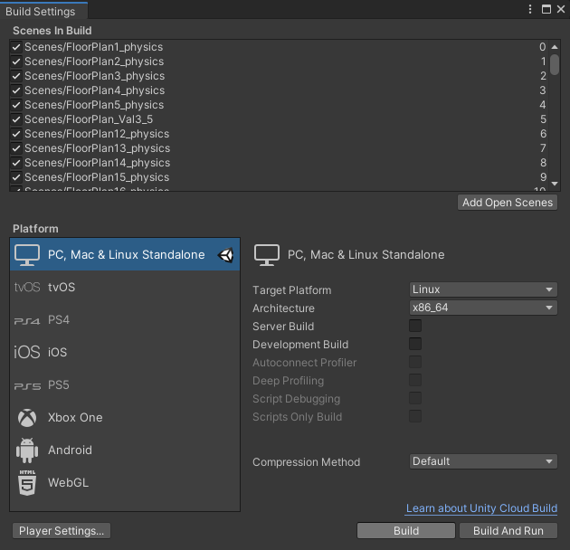

# THOR Data Generation Instructions

This data generation code has been tested on Ubuntu 18.04 with a NVIDIA GTX 1080 and Unity version 2019.4.38f1.

## Compiling a Custom Version of THOR

In [Unity](https://unity.com/) version 2019.4.38f1, open the Unity project from our [custom THOR repo](https://github.com/huy-ha/ai2thor).
Our custom THOR extends it with a [`SceneVolumeExporter`](https://github.com/huy-ha/ai2thor/blob/main/unity/Assets/SceneVolumeExporter.cs) for exporting 3D scenes from THOR.
You can modify the output directory by changing [`rootPath`](https://github.com/huy-ha/ai2thor/blob/main/unity/Assets/SceneVolumeExporter.cs#L8) to somewhere convenient.
This will be the path used for `--path_to_exported_scenes` in `generate_thor_data.py`.
You can also export at a higher [resolution](https://github.com/huy-ha/ai2thor/blob/main/unity/Assets/SceneVolumeExporter.cs#L355), which will take longer to export.

When building the project, make sure to select all scenes.



This will be used for `--path_to_custom_unity` in `generate_thor_data.py`.

## Generating data

### Export/download all 3D scenes

`SceneVolumeExporter` works by [naively grid sampling THOR scenes with a collision probe](https://github.com/huy-ha/ai2thor/blob/main/unity/Assets/SceneVolumeExporter.cs#L378-L420), then dumps the collision results to `.txt` files.
It also [queries all receptacles](https://github.com/huy-ha/ai2thor/blob/main/unity/Assets/SceneVolumeExporter.cs#L131-L172) and dumps this information to a `.txt` file.
The result is the un-transformed 3D semantic occupancy of all 3D scenes at the `rootPath`.
While this is costly, it only needs to be done once.
Alternatively, download our pre-processed exported 3D scenes.

```sh
wget https://semantic-abstraction.cs.columbia.edu/downloads/groundtruth3dpoints.tar.lz4  -O - | tar --use-compress-program=lz4 -xf -  -C ./ 
```


When `generate_thor_data.py` is ran, it will first check that all scenes' ground truth 3D semantic occupancies have been exported to `path_to_exported_scenes`.

Note: if you get "Reading from AI2-THOR backend timed out" errors, you can remove the timeout limit in [AI2THOR's python server](https://github.com/allenai/ai2thor/blob/main/ai2thor/fifo_server.py#L130-L131).


### Generating SemAbs data points

After installing `ai2thor`

```sh
pip install ai2thor==4.2.0
```
you're ready to run the data generation script. It works as follows:
1. choose a random Thor room.
2. choose a random view point in that room.
3. transform and filters the ground truth 3D semantic occupancy at `path_to_exported_scenes` to match the view point.
4. preprocess return value from Thor (segmentation maps, object class names, generate TSDFs, etc.)
5. detect all spatial relations.

An example command might look like this
```sh
python generate_thor_data.py --dataset_dir_path /path/to/dataset --num_pts 50000 --path_to_custom_unity /path/to/unity/exec --path_to_exported_scenes /path/to/3dscenes
```
If you have issues launching THOR, try disabling multi-processing by using the `--local` flag.

### Generating relevancies

The last step is to generate the relevancies for the dumped data points,
```
python generate_relevancy.py dataset /path/to/dataset num_processes
```